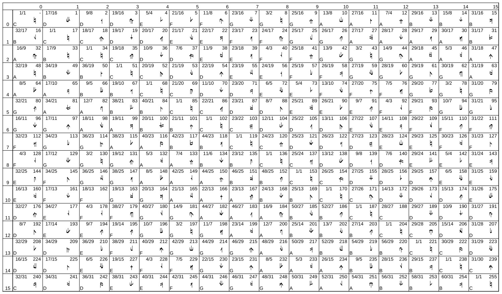

# Diamond_Music
## Code and notebooks for working with Harry Partch's Tonality Diamond using Csound

Specifically, it's a repo for code that simplifies creating music using a Tonality Diamond to the 31-limit. Simplify might be too strong a term here. In order to use this, you will need some pretty awesome Csound chops, and a fair to middling Jupyter Notebook and Python skill set. A degree in music composition would help. Fortunately, that's my talent stack. 

The tonality diamond is a structure that is built using the overtones of a root key. The Wiki page has more information here: 

[Wiki Tonality Diamond Entry](https://en.wikipedia.org/wiki/Tonality_diamond)

Harry Partch first created a diamond with the overtones from 1 to 11. That is, he used pitches constructed from the ratios 1/1, 9/8, 5/4, 11/8, 3/2, 7/4. These notes are close to the 12 tone equal G, A, B, C+, D, F-, where minus is just a bit below natural, but not quite as low as a flat. He then constructed undertones on those overtones. An undertone is the inverse of an overtone, made by flipping the ratios upside down, so you have 2/1, 16/9, 8/5, 16/11, 4/3, 8/7. The overtone ratios are often notated as 8,9,10,11,12,14/8 and the undertones as 16/8, 9, 10, 11, 12, 14. 

I extended the Tonality Diamond first to the 15-limit, then the 31-limit, meaning the overtones from 16,17,18,19,20,21,22,23,24,25,26,27,28,29,30,31/16, and the undertones from 32/32,31,30,29,28,27,26,25,24,23,22,21,20,19,18,17,16.
If you have 16 overtones and 16 undertones on each, you end up with 256 pitches in the tonality diamond. Many are duplicates. Eliminating duplicates you end up with 213 pitches.

Here is a picture of the diamond to the 31 limit, with ratios, a note name in Sagittal notation, and the step in a 256 tone version to the octave scale. This is what Erv Wilson referred to as the cassandra template. 

This repo contains a jupyter notebook and python module that can be used to send notes to an instance of Csound, a tool that takes text files as input and generates an audio file. If you do it right, it is a marvelous way to create music. My use of Csound consists of taking samples of actual instruments and creating music from the samples. But Csound can generate almost every kind of electronic synthesis every conceived. My code requires samples of musical instruments. I've included the required samples in this repo. They include finger piano, balloon drums, guitars, and woodwinds.

## Installation Requirements 

I've found that the simplest way to set up the minimal environment to run this code is to do the following:
<ol>
<li>I recommend the a container builder called toolbox to create containers, but that is optional. It builds containers behind the scenes and give you access to the host file system. 
<code>  
      toolbox create virtual_python
      toolbox enter virtual_python
</code>
</li>
          
<li>Inside the toolbox 
 
      dnf install python3.11
</li>
       
<li>verify it's the right version
 
      python3.11 --version
</li>
             
Optional steps 4 & 5:             

<li>create a REPL to try some python code 
  
      python3.11
</li>
              
<li>execute some sample python code:
 
      print('Hello World!")
      quit()
</li>

Recommended steps 6 & 7
 
<li>build a python virtual environment
  
      python3.11 -m venv virtual_python
</li>
        
<li>Activate the environment
 
      source virtual_python/bin/activate
</li>
        
Required steps:           
  
<li>install pip in the virtual environment             
  
      python3.11 -m pip install --upgrade pip
</li>
              
<li>install other packages:
 
      pip3.11 install jupyterlab
      pip3.11 install numpy 
      pip3.11 install matplotlib
      pip3.11 install scipy
</li>
       
Required if you want to run csound in the notebook:
 
<li>If you want to run csound:
 
      sudo dnf install csound-devel sox
</li>
       
<li>To run the csound with my sample files:
 
      cd Diamond_Music # if you are not already there.

Then unzip the sample files:

      for file in *.zip; do unzip "$file"; done

Make a storage location for the wav files:

      mkdir /home/prent/Music/sflib # this is set at the top of saved.csd 

Run a csd file that csound can process, with the unzipped sample files

      csound saved.csd
</li>

<li>Once this is done, to start up a jupyter lab session:

      jupyter-lab
</li>

<li>When you have finished, you can exit the virtual environment:

      deactivate
</li>

</ol>

### Installation info for toolbox:
https://github.com/containers/toolbox            

## Notes concerning the samples included in the repo

I've included some instrument sample files that are required to run the csound instance and realize the piece of music it creates. Those files are:

-   Oboe_Archive.zip
-   Frn_Hrn_B_Flut_Archive.zip
-   Clar_Bassoon_Archive.zip
-   F_Piano_Guit_Archive.zip

You will need to decompress those into a directory on your computer, and adjust the file "ball3.csd" so that it points to the right directory. In the csound file "ball3.csd" the samples are identified by their location. Currently that is only relevant to my system:

f605 0 0 1 "/home/prent/Dropbox/csound/McGill/Partition I/FingerP/c1.aif" 0 0 0

You will need to edit "ball3.csd" to replace /home/prent/Dropbox/csound/McGill/Partition I/FingerP/c1.aif with the location of that file on your computer. If you don't then csound won't work. You will have to do that with every file in the collection. 

## Notes concerning where csound writes it's output 
Csound creates some very large wave files. I recommend that you put them in  ~/Music/sflib . That's where the two bash scripts in the repo expect them to be, and where the csound files ball3.csd and ball3c.csd put them.

# Examples 
You can listen the some results on http://ripnread.com, with the most recent one here: http://ripnread.com/listen/ball3-t35.mp3
